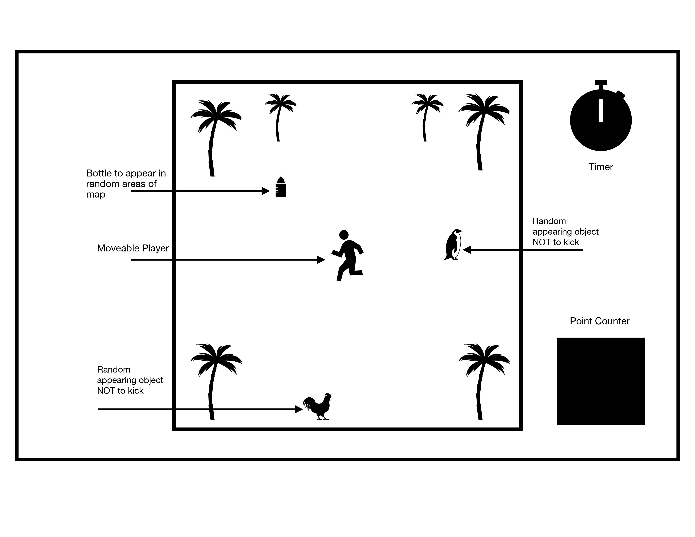

# **P1-Game**

## **Elevator Pitch (About the Game)**

A group of kids are at the park planning to play soccer and nobody brought a ball. Everyone goes into their backpacks to see what they can find to still kick around and help their soccer abilities. Being a hot day, everyone brought multiple bottles of water. They decide to make up a game to see how fast each person can kick randomly placed bottles in a given time. This allowed them to kick things around AND practice their reaction reflexes. They have to also be careful not to accidently kick anything other than the bottle that may appear at the park or their turn will be over regardless on timer.

Goal of the game:
To kick as many bottles as you can using (directional controls) before your time ends. Player with the most bottles kicked at the end of their turns wins.

## **Tech stack to be used**

HTML (Canvas)
CSS
Javascript
Tailwind

## **Wireframe for game**

## **MVP Goals**

[ ] A opening screen with (Start) and (How to Play) buttons

[ ] Creating a park-like area for player to move around

[ ] Make a moveable player

[ ] Have objects (bottle and diversions) randomly pop up on screen

[ ] Have a viewable timer that ends the game

[ ] Have a counter to show how many objects "kicked"

[ ] Auto end game if bottle not kicked

## **Stretch Goals**

[ ] Ability to choose from multiple characters

[ ] Animating the object being kicked (flying off screen)

[ ] Adding mobile "diversions" running across screen

[ ] Increasing diversions everytime counter increases

[ ] Have player gain speed as you kick more items

## **Any potential roadblocks**
